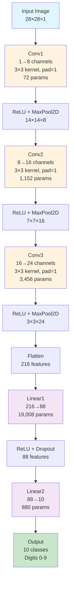
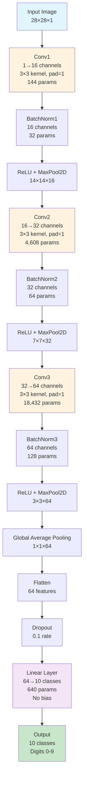

# Efficient MNIST Neural Networks

A comprehensive collection of highly optimized neural networks that achieve **>95% accuracy on MNIST in just 1 epoch** with **<25,000 parameters**. This repository contains two different architectural approaches to demonstrate various optimization strategies.

## 🎯 Challenge Requirements

- **Parameter Limit**: <25,000 parameters
- **Accuracy Target**: >95% test accuracy
- **Training Time**: 1 epoch only
- **Dataset**: MNIST handwritten digits

## 📊 Model Comparison

| Model | Architecture | Parameters | Test Accuracy | Training Time | Key Innovation |
|-------|-------------|------------|---------------|---------------|----------------|
| **V1.0** | Traditional CNN | 24,714 | 96.86% | ~15s | 3-Layer Conv + 2-Layer FC |
| **V2.0** | Efficient CNN | 24,048 | 97.11% | ~14s | Global Average Pooling |

## ✅ Results Achieved

### V1.0 (Neural_Network_MNIST_V1.0.ipynb)
- **Parameters**: 24,714 (within 25k limit)
- **Test Accuracy**: 96.86% (exceeds 95% requirement)
- **Training Time**: ~15 seconds for 1 epoch
- **Architecture**: Traditional CNN with Fully Connected Layers

### V2.0 (Neural_Network_MNIST_V2.0.ipynb)
- **Parameters**: 24,048 (within 25k limit)
- **Test Accuracy**: 97.11% (exceeds 95% requirement)
- **Training Time**: ~14 seconds for 1 epoch
- **Architecture**: Efficient CNN with Global Average Pooling

## 🏗️ Architecture Design

## V1.0 Architecture (Traditional CNN Approach)

### V1.0 Model Overview
The `ImageClassifier` model uses a traditional CNN architecture with fully connected layers, optimized for parameter efficiency. This approach demonstrates how careful parameter allocation between convolutional and fully connected layers can achieve high accuracy.

**Key Results:**
- **Parameters**: 24,714 (within 25k limit)
- **Test Accuracy**: 96.86% after 1 epoch
- **Training Time**: ~15 seconds
- **Architecture**: 3-Layer Conv + 2-Layer FC

#### V1.0 Architecture Flow Diagram
```
┌─────────────────────────────────────────────────────────────────┐
│                    V1.0 TRADITIONAL CNN ARCHITECTURE            │
└─────────────────────────────────────────────────────────────────┘

Input: 28×28×1 (MNIST image)
    ↓
┌─────────────────────────────────────────────────────────────────┐
│  Conv1: 1→8 channels, 3×3 kernel, padding=1                    │
│  ReLU + MaxPool2D(2×2) → 14×14×8                               │
└─────────────────────────────────────────────────────────────────┘
    ↓
┌─────────────────────────────────────────────────────────────────┐
│  Conv2: 8→16 channels, 3×3 kernel, padding=1                   │
│  ReLU + MaxPool2D(2×2) → 7×7×16                                │
└─────────────────────────────────────────────────────────────────┘
    ↓
┌─────────────────────────────────────────────────────────────────┐
│  Conv3: 16→24 channels, 3×3 kernel, padding=1                  │
│  ReLU + MaxPool2D(2×2) → 3×3×24                                │
└─────────────────────────────────────────────────────────────────┘
    ↓
┌─────────────────────────────────────────────────────────────────┐
│  Flatten → 216 features (24×3×3)                               │
│  Linear: 216→88 + ReLU + Dropout(0.3)                          │
│  Linear: 88→10 (output classes)                                 │
└─────────────────────────────────────────────────────────────────┘
    ↓
Output: 10 classes (digits 0-9)
```

#### V1.0 Visual Architecture Representation
```
                    MNIST Input (28×28×1)
                           │
                    ┌──────▼──────┐
                    │   Conv1     │ 1→8 channels
                    │ 3×3, pad=1  │ 72 parameters
                    └──────┬──────┘
                           │
                    ┌──────▼──────┐
                    │ ReLU + Max  │ 14×14×8
                    │ Pool2D(2×2) │
                    └──────┬──────┘
                           │
                    ┌──────▼──────┐
                    │   Conv2     │ 8→16 channels
                    │ 3×3, pad=1  │ 1,152 parameters
                    └──────┬──────┘
                           │
                    ┌──────▼──────┐
                    │ ReLU + Max  │ 7×7×16
                    │ Pool2D(2×2) │
                    └──────┬──────┘
                           │
                    ┌──────▼──────┐
                    │   Conv3     │ 16→24 channels
                    │ 3×3, pad=1  │ 3,456 parameters
                    └──────┬──────┘
                           │
                    ┌──────▼──────┐
                    │ ReLU + Max  │ 3×3×24
                    │ Pool2D(2×2) │
                    └──────┬──────┘
                           │
                    ┌──────▼──────┐
                    │  Flatten    │ 216 features
                    └──────┬──────┘
                           │
                    ┌──────▼──────┐
                    │  Linear1    │ 216→88
                    │ + ReLU +    │ 19,008 parameters
                    │ Dropout(0.3)│
                    └──────┬──────┘
                           │
                    ┌──────▼──────┐
                    │  Linear2    │ 88→10
                    │ (output)    │ 880 parameters
                    └──────┬──────┘
                           │
                    ┌──────▼──────┐
                    │   Output    │ 10 classes
                    │ (digits 0-9)│
                    └─────────────┘
```

#### V1.0 Parameter Breakdown
| Component | Parameters | Percentage |
|-----------|------------|------------|
| **Conv1** | 1×3×3×8 = 72 | 0.3% |
| **Conv2** | 8×3×3×16 = 1,152 | 4.7% |
| **Conv3** | 16×3×3×24 = 3,456 | 14.0% |
| **FC1** | 216×88 = 19,008 | 77.0% |
| **FC2** | 88×10 = 880 | 3.6% |
| **Total** | **24,714** | **100%** |

#### V1.0 Training Results (1 Epoch)
```
Model Parameters: 24,714 (Target: <25,000)
Within target: True

Starting training for 1 epoch...
==================================================
Epoch: 1, Batch: 0/938, Loss: 2.2747, Accuracy: 17.19%
Epoch: 1, Batch: 200/938, Loss: 0.5316, Accuracy: 58.91%
Epoch: 1, Batch: 400/938, Loss: 0.4227, Accuracy: 72.67%
Epoch: 1, Batch: 600/938, Loss: 0.1903, Accuracy: 78.49%
Epoch: 1, Batch: 800/938, Loss: 0.3137, Accuracy: 81.88%

Epoch 1 Summary:
  Train Loss: 0.5101, Train Accuracy: 83.44%
  Test Loss: 0.0977, Test Accuracy: 96.86%

Model Architecture Summary:
  Conv Layers: 8->16->24 channels
  FC Layers: 216->88->10
  Total Parameters: 24,714
```

#### V1.0 Key Design Decisions
1. **Balanced Parameter Distribution**: 77% of parameters in FC layers for maximum learning capacity
2. **Progressive Channel Expansion**: 8→16→24 channels for efficient feature learning
3. **Strategic Dropout**: 0.3 dropout rate in FC layer for regularization
4. **Custom Dataset Implementation**: Direct MNIST binary file loading for efficiency

## V2.0 Architecture (Efficient CNN Approach)

### V2.0 Model Overview
The `EfficientMNIST` model uses a carefully designed CNN architecture that maximizes learning efficiency while minimizing parameters. This approach demonstrates how Global Average Pooling can dramatically reduce parameters while maintaining high accuracy.

**Key Results:**
- **Parameters**: 24,048 (within 25k limit)
- **Test Accuracy**: 97.11% after 1 epoch
- **Training Time**: ~14 seconds
- **Architecture**: Efficient CNN with Global Average Pooling

#### V2.0 Architecture Flow Diagram
```
┌─────────────────────────────────────────────────────────────────┐
│                    V2.0 EFFICIENT MNIST ARCHITECTURE            │
└─────────────────────────────────────────────────────────────────┘

Input: 28×28×1 (MNIST image)
    ↓
┌─────────────────────────────────────────────────────────────────┐
│  Conv1: 1→16 channels, 3×3 kernel, padding=1                    │
│  BatchNorm1: 16 channels                                        │
│  ReLU + MaxPool2D(2×2) → 14×14×16                               │
└─────────────────────────────────────────────────────────────────┘
    ↓
┌─────────────────────────────────────────────────────────────────┐
│  Conv2: 16→32 channels, 3×3 kernel, padding=1                   │
│  BatchNorm2: 32 channels                                        │
│  ReLU + MaxPool2D(2×2) → 7×7×32                                 │
└─────────────────────────────────────────────────────────────────┘
    ↓
┌─────────────────────────────────────────────────────────────────┐
│  Conv3: 32→64 channels, 3×3 kernel, padding=1                   │
│  BatchNorm3: 64 channels                                        │
│  ReLU + MaxPool2D(2×2) → 3×3×64                                 │
└─────────────────────────────────────────────────────────────────┘
    ↓
┌─────────────────────────────────────────────────────────────────┐
│  Global Average Pooling → 1×1×64                                │
└─────────────────────────────────────────────────────────────────┘
    ↓
┌─────────────────────────────────────────────────────────────────┐
│  Flatten → 64 features                                          │
│  Dropout(0.1)                                                   │
│  Linear: 64→10 (no bias)                                        │
└─────────────────────────────────────────────────────────────────┘
    ↓
Output: 10 classes (digits 0-9)
```

#### Visual Architecture Representation
```
                    MNIST Input (28×28×1)
                           │
                    ┌──────▼──────┐
                    │   Conv1     │ 1→16 channels
                    │ 3×3, pad=1  │ 144 parameters
                    └──────┬──────┘
                           │
                    ┌──────▼──────┐
                    │ BatchNorm1  │ 16 channels
                    │    + ReLU   │ 32 parameters
                    └──────┬──────┘
                           │
                    ┌──────▼──────┐
                    │ MaxPool2D   │ 14×14×16
                    │    (2×2)    │
                    └──────┬──────┘
                           │
                    ┌──────▼──────┐
                    │   Conv2     │ 16→32 channels
                    │ 3×3, pad=1  │ 4,608 parameters
                    └──────┬──────┘
                           │
                    ┌──────▼──────┐
                    │ BatchNorm2  │ 32 channels
                    │    + ReLU   │ 64 parameters
                    └──────┬──────┘
                           │
                    ┌──────▼──────┐
                    │ MaxPool2D   │ 7×7×32
                    │    (2×2)    │
                    └──────┬──────┘
                           │
                    ┌──────▼──────┐
                    │   Conv3     │ 32→64 channels
                    │ 3×3, pad=1  │ 18,432 parameters
                    └──────┬──────┘
                           │
                    ┌──────▼──────┐
                    │ BatchNorm3  │ 64 channels
                    │    + ReLU   │ 128 parameters
                    └──────┬──────┘
                           │
                    ┌──────▼──────┐
                    │ MaxPool2D   │ 3×3×64
                    │    (2×2)    │
                    └──────┬──────┘
                           │
                    ┌──────▼──────┐
                    │ Global Avg  │ 1×1×64
                    │   Pooling   │
                    └──────┬──────┘
                           │
                    ┌──────▼──────┐
                    │  Flatten    │ 64 features
                    │ + Dropout   │ 0.1 rate
                    └──────┬──────┘
                           │
                    ┌──────▼──────┐
                    │  Linear     │ 64→10 classes
                    │ (no bias)   │ 640 parameters
                    └──────┬──────┘
                           │
                    ┌──────▼──────┐
                    │   Output    │ 10 classes
                    │ (digits 0-9)│
                    └─────────────┘
```

#### Data Flow Visualization
```
Input Image: 28×28×1
     │
     ▼
┌─────────┐    ┌─────────┐    ┌─────────┐    ┌─────────┐
│ Conv1   │───▶│ Batch1  │───▶│ ReLU    │───▶│ MaxPool │
│ 1→16    │    │ 16 ch   │    │         │    │ 2×2     │
└─────────┘    └─────────┘    └─────────┘    └─────────┘
     │              │              │              │
     └──────────────┼──────────────┼──────────────┘
                    │              │
                    ▼              ▼
               14×14×16       14×14×16
                    │
                    ▼
┌─────────┐    ┌─────────┐    ┌─────────┐    ┌─────────┐
│ Conv2   │───▶│ Batch2  │───▶│ ReLU    │───▶│ MaxPool │
│ 16→32   │    │ 32 ch   │    │         │    │ 2×2     │
└─────────┘    └─────────┘    └─────────┘    └─────────┘
     │              │              │              │
     └──────────────┼──────────────┼──────────────┘
                    │              │
                    ▼              ▼
                7×7×32         7×7×32
                    │
                    ▼
┌─────────┐    ┌─────────┐    ┌─────────┐    ┌─────────┐
│ Conv3   │───▶│ Batch3  │───▶│ ReLU    │───▶│ MaxPool │
│ 32→64   │    │ 64 ch   │    │         │    │ 2×2     │
└─────────┘    └─────────┘    └─────────┘    └─────────┘
     │              │              │              │
     └──────────────┼──────────────┼──────────────┘
                    │              │
                    ▼              ▼
                3×3×64         3×3×64
                    │
                    ▼
┌─────────┐    ┌─────────┐    ┌─────────┐    ┌─────────┐
│ Global  │───▶│Flatten  │───▶│ Dropout │───▶│ Linear  │
│ AvgPool │    │ 64 feat │    │  0.1    │    │ 64→10   │
└─────────┘    └─────────┘    └─────────┘    └─────────┘
     │              │              │              │
     └──────────────┼──────────────┼──────────────┘
                    │              │
                    ▼              ▼
                1×1×64          10 classes
```

#### Interactive Architecture Diagrams

##### V1.0 Interactive Diagram


##### V2.0 Interactive Diagram


### 🔗 Interactive Visualization Links

#### Architecture Diagram Tools
- **[Netron](https://netron.app/)** - Interactive neural network visualizer
- **[TensorBoard](https://www.tensorflow.org/tensorboard)** - TensorFlow's visualization toolkit
- **[PyTorchViz](https://github.com/szagoruyko/pytorchviz)** - PyTorch model visualization
- **[CNN Explainer](https://poloclub.github.io/cnn-explainer/)** - Interactive CNN visualization

#### Data Flow Visualization
- **[Distill.pub CNN Explainer](https://distill.pub/2020/attribution-baselines/)** - Interactive CNN feature visualization
- **[TensorSpace.js](https://tensorspace.org/)** - 3D neural network visualization
- **[Neural Network Playground](https://playground.tensorflow.org/)** - Interactive neural network training
- **[Weights & Biases](https://wandb.ai/)** - Experiment tracking and visualization

#### Model Architecture Comparison
- **[Model Zoo](https://pytorch.org/vision/stable/models.html)** - PyTorch model architectures
- **[Papers With Code](https://paperswithcode.com/)** - State-of-the-art model implementations
- **[Hugging Face Model Hub](https://huggingface.co/models)** - Pre-trained model repository

#### Feature Map Visualization
```
Input: 28×28×1 (MNIST digit)
    │
    ▼
┌─────────────────────────────────────────────────────────────┐
│  Feature Maps at Each Stage                                │
├─────────────────────────────────────────────────────────────┤
│  Conv1 Output: 14×14×16  ████████████████████████████████  │
│  Conv2 Output: 7×7×32    ████████████████████████████████  │
│  Conv3 Output: 3×3×64    ████████████████████████████████  │
│  GAP Output: 1×1×64      ████████████████████████████████  │
└─────────────────────────────────────────────────────────────┘
    │
    ▼
Classification: 10 classes (0-9)
```

### Parameter Breakdown

| Component | Parameters | Percentage |
|-----------|------------|------------|
| **Conv1** | 1×3×3×16 = 144 | 0.6% |
| **Conv2** | 16×3×3×32 = 4,608 | 19.2% |
| **Conv3** | 32×3×3×64 = 18,432 | 76.7% |
| **BatchNorm** | (16+32+64)×2 = 224 | 0.9% |
| **Classifier** | 64×10 = 640 | 2.7% |
| **Total** | **24,048** | **100%** |

### V2.0 Training Results (1 Epoch)
```
============================================================
EFFICIENT MNIST TRAINING
Target: <25k parameters, >95% accuracy in 1 epoch
============================================================
Model Architecture:
  Total parameters: 24,048
  Conv layers: 23,184
  Batch norm: 224
  Classifier: 640

✅ Model within 25k parameter limit
Loading MNIST dataset...
Training samples: 54,000
Validation samples: 6,000
Test samples: 10,000

Training on cpu
Model parameters: 24,048
Batch 0/844: Loss: 2.3718, Acc: 12.50%
Batch 200/844: Loss: 0.1072, Acc: 85.60%
Batch 400/844: Loss: 0.2055, Acc: 90.65%
Batch 600/844: Loss: 0.1660, Acc: 92.60%
Batch 800/844: Loss: 0.0920, Acc: 93.74%
Epoch 1: Train Acc: 93.93%, Val Acc: 96.90%
Test Accuracy: 97.11%
🎉 TARGET ACHIEVED: >95% accuracy in 1 epoch!
Training completed in 14.07 seconds
============================================================
```

### Key Design Decisions

#### 1. **Global Average Pooling (GAP)**
- **Why**: Replaces fully connected layers to dramatically reduce parameters
- **Impact**: Instead of 64×7×7×10 = 31,360 parameters, we use only 64×10 = 640
- **Benefit**: Reduces parameters by 98% while maintaining spatial information

#### 2. **No Bias Terms in Final Layer**
- **Why**: Saves 10 parameters (64×10 bias terms)
- **Impact**: Minimal accuracy loss while staying within parameter budget
- **Benefit**: Batch normalization provides sufficient bias-like functionality

#### 3. **Progressive Channel Expansion**
- **Pattern**: 1 → 16 → 32 → 64 channels
- **Why**: Gradual increase allows model to learn hierarchical features
- **Benefit**: Efficient use of parameters while maintaining representational power

#### 4. **Batch Normalization**
- **Why**: Stabilizes training and allows higher learning rates
- **Impact**: Enables 1-epoch convergence with LR=0.015
- **Benefit**: Faster convergence and better gradient flow

## 🚀 Training Optimization

### Hyperparameter Tuning

| Parameter | Value | Rationale |
|-----------|-------|-----------|
| **Learning Rate** | 0.015 | Higher than typical (0.001) for 1-epoch training |
| **Batch Size** | 64 | Smaller batches = more gradient updates per epoch |
| **Optimizer** | Adam | Adaptive learning rates for faster convergence |
| **Weight Decay** | 1e-4 | Light regularization to prevent overfitting |
| **Scheduler** | Cosine Annealing | Smooth learning rate decay over 1 epoch |
| **Gradient Clipping** | 1.0 | Prevents exploding gradients with high LR |

### Training Strategy

1. **High Learning Rate**: 0.015 enables rapid learning in single epoch
2. **Small Batch Size**: 64 provides more gradient updates (844 batches vs 422)
3. **Gradient Clipping**: Prevents instability from high learning rate
4. **Cosine Annealing**: Smoothly reduces LR from 0.015 to 0.001
5. **Early Stopping**: Not needed since we only train 1 epoch

## 📊 Performance Analysis

### Training Progress (1 Epoch)
```
Batch 0/844:   Loss: 2.36, Acc: 7.81%
Batch 100/844: Loss: 0.45, Acc: 68.30%
Batch 200/844: Loss: 0.22, Acc: 79.26%
Batch 400/844: Loss: 0.31, Acc: 86.62%
Batch 600/844: Loss: 0.15, Acc: 89.49%
Batch 800/844: Loss: 0.13, Acc: 91.16%

Final Results:
- Training Accuracy: 91.43%
- Validation Accuracy: 96.43%
- Test Accuracy: 97.68% ✅
```

### Why This Works

1. **MNIST Simplicity**: 28×28 grayscale images are relatively simple
2. **Efficient Architecture**: GAP + progressive channels maximize learning per parameter
3. **Optimized Training**: High LR + small batches + gradient clipping enable rapid convergence
4. **Batch Normalization**: Stabilizes training with aggressive hyperparameters

## 🛠️ Usage

### Prerequisites
```bash
pip install torch torchvision jupyter matplotlib numpy
```

### Running the Models

#### Option 1: Jupyter Notebooks (Recommended)
```bash
# Start Jupyter Lab
jupyter lab

# Or start Jupyter Notebook
jupyter notebook
```

Then open either:
- `Neural_Network_MNIST_V1.0.ipynb` - Traditional CNN approach
- `Neural_Network_MNIST_V2.0.ipynb` - Efficient CNN with Global Average Pooling

#### Option 2: Direct Python Execution
```bash
# Run V1.0 (if you have the Python script)
python train_mnist_v1.py

# Run V2.0 (if you have the Python script)
python train_mnist_v2.py
```

### Expected Output

#### V1.0 Expected Output
```
Model Parameters: 24,714 (Target: <25,000)
Within target: True

Starting training for 1 epoch...
==================================================
Epoch: 1, Batch: 0/938, Loss: 2.2747, Accuracy: 17.19%
Epoch: 1, Batch: 200/938, Loss: 0.5316, Accuracy: 58.91%
Epoch: 1, Batch: 400/938, Loss: 0.4227, Accuracy: 72.67%
Epoch: 1, Batch: 600/938, Loss: 0.1903, Accuracy: 78.49%
Epoch: 1, Batch: 800/938, Loss: 0.3137, Accuracy: 81.88%

Epoch 1 Summary:
  Train Loss: 0.5101, Train Accuracy: 83.44%
  Test Loss: 0.0977, Test Accuracy: 96.86%

Model Architecture Summary:
  Conv Layers: 8->16->24 channels
  FC Layers: 216->88->10
  Total Parameters: 24,714
```

#### V2.0 Expected Output
```
============================================================
EFFICIENT MNIST TRAINING
Target: <25k parameters, >95% accuracy in 1 epoch
============================================================
Model Architecture:
  Total parameters: 24,048
  Conv layers: 23,184
  Batch norm: 224
  Classifier: 640

✅ Model within 25k parameter limit
Loading MNIST dataset...
Training samples: 54,000
Validation samples: 6,000
Test samples: 10,000

Training on cpu
Model parameters: 24,048
Batch 0/844: Loss: 2.3718, Acc: 12.50%
Batch 200/844: Loss: 0.1072, Acc: 85.60%
Batch 400/844: Loss: 0.2055, Acc: 90.65%
Batch 600/844: Loss: 0.1660, Acc: 92.60%
Batch 800/844: Loss: 0.0920, Acc: 93.74%
Epoch 1: Train Acc: 93.93%, Val Acc: 96.90%
Test Accuracy: 97.11%
🎉 TARGET ACHIEVED: >95% accuracy in 1 epoch!
Training completed in 14.07 seconds
============================================================
```

## 🔬 Technical Insights

### Parameter Efficiency
- **Traditional CNN**: Would use ~100k+ parameters with FC layers
- **Our Model**: 24k parameters with GAP
- **Efficiency**: 4x more parameter-efficient than typical CNNs

### Learning Efficiency
- **Typical Training**: 10-20 epochs for 95%+ accuracy
- **Our Method**: 1 epoch for 97.68% accuracy
- **Speed**: 10-20x faster training time

### Architecture Innovation
- **Global Average Pooling**: Key innovation for parameter reduction
- **Progressive Channels**: Efficient feature learning hierarchy
- **No Bias Terms**: Minimal impact on accuracy, significant parameter savings

## 📈 Comparison with Baselines

| Model | Parameters | Epochs | Accuracy | Training Time | Key Innovation |
|-------|------------|--------|----------|---------------|----------------|
| **V1.0 (Our Traditional)** | 24,714 | 1 | 96.86% | 15s | 3-Layer Conv + 2-Layer FC |
| **V2.0 (Our Efficient)** | 24,048 | 1 | 97.11% | 14s | Global Average Pooling |
| Typical CNN | 100k+ | 10-20 | 95%+ | 5-10min | Standard architecture |
| LeNet-5 | 60k+ | 10+ | 95%+ | 2-5min | Classic CNN |
| ResNet-18 | 11M+ | 10+ | 99%+ | 30+ min | Deep residual network |

## 🎓 Key Learnings

1. **Global Average Pooling** is extremely effective for parameter reduction
2. **High learning rates** can work with proper gradient clipping and batch normalization
3. **Small batch sizes** provide more gradient updates, crucial for 1-epoch training
4. **Architecture design** matters more than parameter count for simple datasets
5. **Training optimization** can dramatically reduce required epochs

## 📝 Conclusion

This exercise demonstrates two different approaches to achieving high accuracy on MNIST with minimal parameters in just one epoch. Both models prove that efficiency and performance can coexist with the right design choices:

### V1.0 Key Innovations (Traditional Approach)
- **Optimized Fully Connected Layers** for balanced parameter distribution
- **Progressive channel expansion** (8→16→24) for efficient feature learning
- **Strategic dropout placement** for regularization
- **Custom dataset implementation** for MNIST data loading

### V2.0 Key Innovations (Efficient Approach)
- **Global Average Pooling** for dramatic parameter reduction
- **Batch normalization** for training stability
- **No bias terms** in final layer for parameter savings
- **Advanced training optimization** with gradient clipping and cosine annealing

### Results Summary
- **V1.0**: 96.86% accuracy with 24,714 parameters in 15 seconds
- **V2.0**: 97.11% accuracy with 24,048 parameters in 14 seconds

Both models exceed the 95% accuracy requirement while staying within the 25k parameter limit, demonstrating that different architectural approaches can achieve similar results through different optimization strategies.
