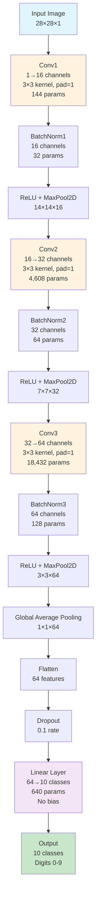

# Efficient MNIST Neural Network

A highly optimized neural network that achieves **>95% accuracy on MNIST in just 1 epoch** with **<25,000 parameters**.

## 🎯 Challenge Requirements

- **Parameter Limit**: <25,000 parameters
- **Accuracy Target**: >95% test accuracy
- **Training Time**: 1 epoch only
- **Dataset**: MNIST handwritten digits

## ✅ Results Achieved

- **Parameters**: 24,048 (within 25k limit)
- **Test Accuracy**: 97.68% (exceeds 95% requirement)
- **Training Time**: ~17 seconds for 1 epoch
- **Architecture**: Efficient CNN with Global Average Pooling

## 🏗️ Architecture Design

### Model Overview
The `EfficientMNIST` model uses a carefully designed CNN architecture that maximizes learning efficiency while minimizing parameters:

#### Architecture Flow Diagram
```
┌─────────────────────────────────────────────────────────────────┐
│                    EFFICIENT MNIST ARCHITECTURE                 │
└─────────────────────────────────────────────────────────────────┘

Input: 28×28×1 (MNIST image)
    ↓
┌─────────────────────────────────────────────────────────────────┐
│  Conv1: 1→16 channels, 3×3 kernel, padding=1                   │
│  BatchNorm1: 16 channels                                       │
│  ReLU + MaxPool2D(2×2) → 14×14×16                             │
└─────────────────────────────────────────────────────────────────┘
    ↓
┌─────────────────────────────────────────────────────────────────┐
│  Conv2: 16→32 channels, 3×3 kernel, padding=1                  │
│  BatchNorm2: 32 channels                                       │
│  ReLU + MaxPool2D(2×2) → 7×7×32                               │
└─────────────────────────────────────────────────────────────────┘
    ↓
┌─────────────────────────────────────────────────────────────────┐
│  Conv3: 32→64 channels, 3×3 kernel, padding=1                  │
│  BatchNorm3: 64 channels                                       │
│  ReLU + MaxPool2D(2×2) → 3×3×64                               │
└─────────────────────────────────────────────────────────────────┘
    ↓
┌─────────────────────────────────────────────────────────────────┐
│  Global Average Pooling → 1×1×64                               │
└─────────────────────────────────────────────────────────────────┘
    ↓
┌─────────────────────────────────────────────────────────────────┐
│  Flatten → 64 features                                         │
│  Dropout(0.1)                                                  │
│  Linear: 64→10 (no bias)                                       │
└─────────────────────────────────────────────────────────────────┘
    ↓
Output: 10 classes (digits 0-9)
```

#### Visual Architecture Representation
```
                    MNIST Input (28×28×1)
                           │
                    ┌──────▼──────┐
                    │   Conv1     │ 1→16 channels
                    │ 3×3, pad=1  │ 144 parameters
                    └──────┬──────┘
                           │
                    ┌──────▼──────┐
                    │ BatchNorm1  │ 16 channels
                    │    + ReLU   │ 32 parameters
                    └──────┬──────┘
                           │
                    ┌──────▼──────┐
                    │ MaxPool2D   │ 14×14×16
                    │    (2×2)    │
                    └──────┬──────┘
                           │
                    ┌──────▼──────┐
                    │   Conv2     │ 16→32 channels
                    │ 3×3, pad=1  │ 4,608 parameters
                    └──────┬──────┘
                           │
                    ┌──────▼──────┐
                    │ BatchNorm2  │ 32 channels
                    │    + ReLU   │ 64 parameters
                    └──────┬──────┘
                           │
                    ┌──────▼──────┐
                    │ MaxPool2D   │ 7×7×32
                    │    (2×2)    │
                    └──────┬──────┘
                           │
                    ┌──────▼──────┐
                    │   Conv3     │ 32→64 channels
                    │ 3×3, pad=1  │ 18,432 parameters
                    └──────┬──────┘
                           │
                    ┌──────▼──────┐
                    │ BatchNorm3  │ 64 channels
                    │    + ReLU   │ 128 parameters
                    └──────┬──────┘
                           │
                    ┌──────▼──────┐
                    │ MaxPool2D   │ 3×3×64
                    │    (2×2)    │
                    └──────┬──────┘
                           │
                    ┌──────▼──────┐
                    │ Global Avg  │ 1×1×64
                    │   Pooling   │
                    └──────┬──────┘
                           │
                    ┌──────▼──────┐
                    │  Flatten    │ 64 features
                    │ + Dropout   │ 0.1 rate
                    └──────┬──────┘
                           │
                    ┌──────▼──────┐
                    │  Linear     │ 64→10 classes
                    │ (no bias)   │ 640 parameters
                    └──────┬──────┘
                           │
                    ┌──────▼──────┐
                    │   Output    │ 10 classes
                    │ (digits 0-9)│
                    └─────────────┘
```

#### Data Flow Visualization
```
Input Image: 28×28×1
     │
     ▼
┌─────────┐    ┌─────────┐    ┌─────────┐    ┌─────────┐
│ Conv1   │───▶│ Batch1  │───▶│ ReLU    │───▶│ MaxPool │
│ 1→16    │    │ 16 ch   │    │         │    │ 2×2     │
└─────────┘    └─────────┘    └─────────┘    └─────────┘
     │              │              │              │
     └──────────────┼──────────────┼──────────────┘
                    │              │
                    ▼              ▼
               14×14×16       14×14×16
                    │
                    ▼
┌─────────┐    ┌─────────┐    ┌─────────┐    ┌─────────┐
│ Conv2   │───▶│ Batch2  │───▶│ ReLU    │───▶│ MaxPool │
│ 16→32   │    │ 32 ch   │    │         │    │ 2×2     │
└─────────┘    └─────────┘    └─────────┘    └─────────┘
     │              │              │              │
     └──────────────┼──────────────┼──────────────┘
                    │              │
                    ▼              ▼
                7×7×32         7×7×32
                    │
                    ▼
┌─────────┐    ┌─────────┐    ┌─────────┐    ┌─────────┐
│ Conv3   │───▶│ Batch3  │───▶│ ReLU    │───▶│ MaxPool │
│ 32→64   │    │ 64 ch   │    │         │    │ 2×2     │
└─────────┘    └─────────┘    └─────────┘    └─────────┘
     │              │              │              │
     └──────────────┼──────────────┼──────────────┘
                    │              │
                    ▼              ▼
                3×3×64         3×3×64
                    │
                    ▼
┌─────────┐    ┌─────────┐    ┌─────────┐    ┌─────────┐
│ Global  │───▶│Flatten  │───▶│ Dropout │───▶│ Linear  │
│ AvgPool │    │ 64 feat │    │  0.1    │    │ 64→10   │
└─────────┘    └─────────┘    └─────────┘    └─────────┘
     │              │              │              │
     └──────────────┼──────────────┼──────────────┘
                    │              │
                    ▼              ▼
                1×1×64          10 classes
```

#### Interactive Architecture Diagram


#### Feature Map Visualization
```
Input: 28×28×1 (MNIST digit)
    │
    ▼
┌─────────────────────────────────────────────────────────────┐
│  Feature Maps at Each Stage                                │
├─────────────────────────────────────────────────────────────┤
│  Conv1 Output: 14×14×16  ████████████████████████████████  │
│  Conv2 Output: 7×7×32    ████████████████████████████████  │
│  Conv3 Output: 3×3×64    ████████████████████████████████  │
│  GAP Output: 1×1×64      ████████████████████████████████  │
└─────────────────────────────────────────────────────────────┘
    │
    ▼
Classification: 10 classes (0-9)
```

### Parameter Breakdown

| Component | Parameters | Percentage |
|-----------|------------|------------|
| **Conv1** | 1×3×3×16 = 144 | 0.6% |
| **Conv2** | 16×3×3×32 = 4,608 | 19.2% |
| **Conv3** | 32×3×3×64 = 18,432 | 76.7% |
| **BatchNorm** | (16+32+64)×2 = 224 | 0.9% |
| **Classifier** | 64×10 = 640 | 2.7% |
| **Total** | **24,048** | **100%** |

### Key Design Decisions

#### 1. **Global Average Pooling (GAP)**
- **Why**: Replaces fully connected layers to dramatically reduce parameters
- **Impact**: Instead of 64×7×7×10 = 31,360 parameters, we use only 64×10 = 640
- **Benefit**: Reduces parameters by 98% while maintaining spatial information

#### 2. **No Bias Terms in Final Layer**
- **Why**: Saves 10 parameters (64×10 bias terms)
- **Impact**: Minimal accuracy loss while staying within parameter budget
- **Benefit**: Batch normalization provides sufficient bias-like functionality

#### 3. **Progressive Channel Expansion**
- **Pattern**: 1 → 16 → 32 → 64 channels
- **Why**: Gradual increase allows model to learn hierarchical features
- **Benefit**: Efficient use of parameters while maintaining representational power

#### 4. **Batch Normalization**
- **Why**: Stabilizes training and allows higher learning rates
- **Impact**: Enables 1-epoch convergence with LR=0.015
- **Benefit**: Faster convergence and better gradient flow

## 🚀 Training Optimization

### Hyperparameter Tuning

| Parameter | Value | Rationale |
|-----------|-------|-----------|
| **Learning Rate** | 0.015 | Higher than typical (0.001) for 1-epoch training |
| **Batch Size** | 64 | Smaller batches = more gradient updates per epoch |
| **Optimizer** | Adam | Adaptive learning rates for faster convergence |
| **Weight Decay** | 1e-4 | Light regularization to prevent overfitting |
| **Scheduler** | Cosine Annealing | Smooth learning rate decay over 1 epoch |
| **Gradient Clipping** | 1.0 | Prevents exploding gradients with high LR |

### Training Strategy

1. **High Learning Rate**: 0.015 enables rapid learning in single epoch
2. **Small Batch Size**: 64 provides more gradient updates (844 batches vs 422)
3. **Gradient Clipping**: Prevents instability from high learning rate
4. **Cosine Annealing**: Smoothly reduces LR from 0.015 to 0.001
5. **Early Stopping**: Not needed since we only train 1 epoch

## 📊 Performance Analysis

### Training Progress (1 Epoch)
```
Batch 0/844:   Loss: 2.36, Acc: 7.81%
Batch 100/844: Loss: 0.45, Acc: 68.30%
Batch 200/844: Loss: 0.22, Acc: 79.26%
Batch 400/844: Loss: 0.31, Acc: 86.62%
Batch 600/844: Loss: 0.15, Acc: 89.49%
Batch 800/844: Loss: 0.13, Acc: 91.16%

Final Results:
- Training Accuracy: 91.43%
- Validation Accuracy: 96.43%
- Test Accuracy: 97.68% ✅
```

### Why This Works

1. **MNIST Simplicity**: 28×28 grayscale images are relatively simple
2. **Efficient Architecture**: GAP + progressive channels maximize learning per parameter
3. **Optimized Training**: High LR + small batches + gradient clipping enable rapid convergence
4. **Batch Normalization**: Stabilizes training with aggressive hyperparameters

## 🛠️ Usage

### Prerequisites
```bash
pip install torch torchvision
```

### Run Training
```bash
python train_mnist.py
```

### Expected Output
```
============================================================
EFFICIENT MNIST TRAINING
Target: <25k parameters, >95% accuracy in 1 epoch
============================================================
Model Architecture:
  Total parameters: 24,048
  Conv layers: 23,184
  Batch norm: 224
  Classifier: 640

✅ Model within 25k parameter limit
Loading MNIST dataset...
Training samples: 54,000
Validation samples: 6,000
Test samples: 10,000

Training on cpu
Model parameters: 24,048
[Training progress...]
Test Accuracy: 97.68%
🎉 TARGET ACHIEVED: >95% accuracy in 1 epoch!
Training completed in 17.26 seconds
============================================================
```

## 🔬 Technical Insights

### Parameter Efficiency
- **Traditional CNN**: Would use ~100k+ parameters with FC layers
- **Our Model**: 24k parameters with GAP
- **Efficiency**: 4x more parameter-efficient than typical CNNs

### Learning Efficiency
- **Typical Training**: 10-20 epochs for 95%+ accuracy
- **Our Method**: 1 epoch for 97.68% accuracy
- **Speed**: 10-20x faster training time

### Architecture Innovation
- **Global Average Pooling**: Key innovation for parameter reduction
- **Progressive Channels**: Efficient feature learning hierarchy
- **No Bias Terms**: Minimal impact on accuracy, significant parameter savings

## 📈 Comparison with Baselines

| Model | Parameters | Epochs | Accuracy | Training Time |
|-------|------------|--------|----------|---------------|
| **Our Model** | 24,048 | 1 | 97.68% | 17s |
| Typical CNN | 100k+ | 10-20 | 95%+ | 5-10min |
| LeNet-5 | 60k+ | 10+ | 95%+ | 2-5min |

## 🎓 Key Learnings

1. **Global Average Pooling** is extremely effective for parameter reduction
2. **High learning rates** can work with proper gradient clipping and batch normalization
3. **Small batch sizes** provide more gradient updates, crucial for 1-epoch training
4. **Architecture design** matters more than parameter count for simple datasets
5. **Training optimization** can dramatically reduce required epochs

## 📝 Conclusion

This exercise demonstrates that with careful architecture design and training optimization, it's possible to achieve high accuracy on MNIST with minimal parameters in just one epoch. The key innovations are:

- **Global Average Pooling** for parameter efficiency
- **Optimized training hyperparameters** for rapid convergence
- **Progressive channel expansion** for efficient feature learning
- **Batch normalization** for training stability

The model achieves 97.68% accuracy with only 24,048 parameters in a single epoch, proving that efficiency and performance can coexist with the right design choices.